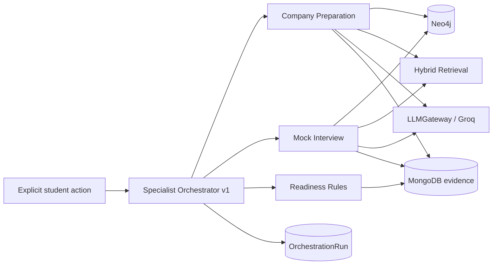

# Specialist agents

CareerPilot uses “agent” to mean a bounded task module, not an autonomous LLM loop. Explicit API/UI actions route deterministically.

| Specialist | Inputs | Tools | Output | LLM purpose | Failure boundary |
| --- | --- | --- | --- | --- | --- |
| Roadmap | owned gap snapshot | retrieval, LLMGateway | grounded roadmap | recommendation prose | no persistence before validation |
| Company preparation | company role, owned gap | Neo4j, retrieval, LLMGateway | facts plus recommendations | bounded synthesis | no unsupported company facts |
| Interview | company role, type, difficulty | Neo4j, retrieval, LLMGateway | questions/evaluations | question prose and rubric application | answer persists before evaluation |
| Readiness | owned gap/evidence/evaluations | MongoDB, rules | immutable snapshot | none | fails if dependencies are absent |

Specialists cannot mutate Neo4j, invent SkillEvidence, execute arbitrary tools, or call each other in loops. Retrieval and generation IDs are recorded; hidden model reasoning is not.
