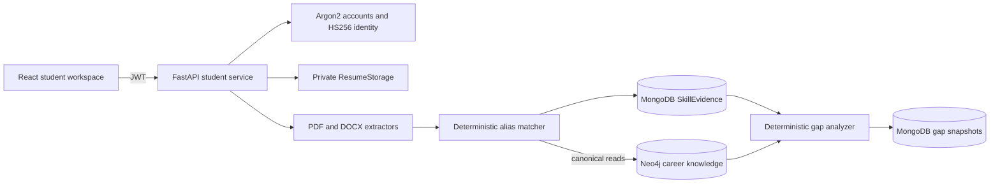
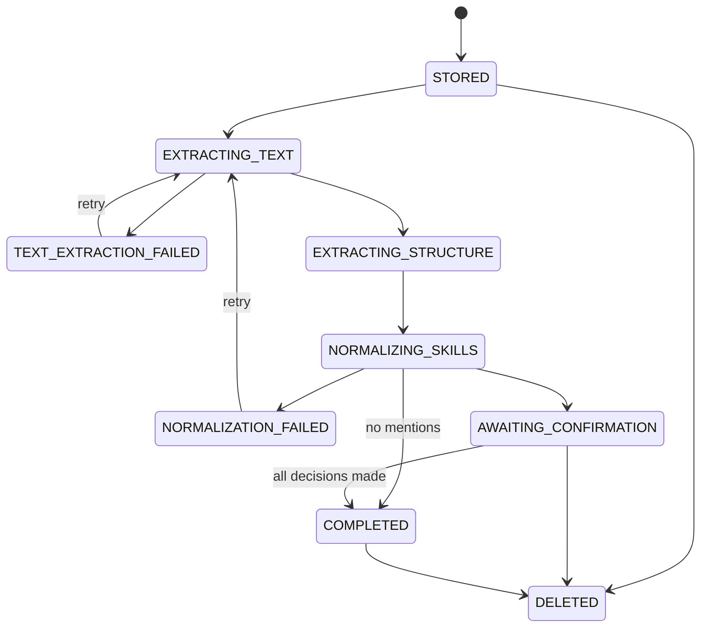

# Student evidence architecture

Phase 3 treats resume content as private evidence. It never turns a resume mention into a proficiency claim.

## Ownership boundaries

MongoDB owns accounts, profiles, resume metadata, processing runs, evidence decisions, and gap snapshots. Neo4j owns canonical skills, roles, requirements, assertions, and dataset provenance. Resume processing reads canonical IDs from Neo4j; it never writes student nodes, `HAS_SKILL` edges, or new canonical skills.

Every private route derives `student_id` from a signed bearer token. Repository reads and mutations include that owner ID. Foreign IDs therefore return the same not-found shape as nonexistent IDs. The frontend never supplies an owner ID.

## Resume lifecycle

The accepted formats are PDF and DOCX. Validation checks the extension, declared media type, signature, size, emptiness, safe metadata filename, parser integrity, PDF page count, extracted-text bound, and DOCX archive entry, expanded-size, and compression-ratio limits. The storage key is a generated resume ID and extension. Files live below a private configurable root and are never mounted as static content.

Text extraction uses `pypdf` and `python-docx`. It preserves lines, recognizes a small set of section headings, and bounds work. Image-only PDFs fail with `RESUME_EXTRACTION_FAILED`; OCR is not implemented. The semantic pass uses the live canonical Skill registry. Exact case-insensitive names and curated aliases map to canonical IDs. Other tokens in a skills section stay `UNRESOLVED`. Related technologies are not inferred as equivalent.

The parser version and a stable evidence identity make a retry idempotent. Existing confirmation decisions survive the same-parser retry. An identical hash for the same student returns the existing record with `duplicate=true`. A different valid upload receives the next immutable version and becomes the one active resume; prior records and evidence remain traceable.

## Evidence and gap rules

Each evidence record retains its resume, raw mention, section, bounded context, normalization status, extraction method, canonical ID when known, and `EXTRACTED`, `CONFIRMED`, or `REJECTED` decision. A correction is accepted only after Neo4j confirms the supplied canonical Skill ID.

`gap-rules-v1` applies only direct canonical evidence:

| Evidence for required canonical skill | Result | Reason |
| --- | --- | --- |
| At least one `CONFIRMED` record | `SUPPORTED` | `CONFIRMED_DIRECT_EVIDENCE` |
| At least one non-rejected `EXTRACTED` record | `PARTIALLY_SUPPORTED` | `UNCONFIRMED_DIRECT_EVIDENCE` |
| No non-rejected direct evidence | `UNVERIFIED` | `NO_DIRECT_EVIDENCE` |

The result preserves Neo4j importance and assertion ID. Each run stores its rule version, profile version, evidence snapshot hash, canonical dataset version, evidence IDs, and timestamp. `UNVERIFIED` means CareerPilot lacks direct evidence; it does not mean the student lacks the skill.

## Consistency, deletion, and scaling

The local MongoDB deployment is standalone, so account/profile creation uses compensation instead of a transaction. If file storage succeeds and resume persistence fails, the service removes the file. Extraction or Neo4j failure retains metadata, the private file, processing history, and an explicit failure status for retry.

Deleting a resume tombstones its metadata, removes its file, processing run, and derived evidence, while retaining historical gap snapshots. A snapshot still contains its evidence hash, referenced evidence IDs, graph assertions, and versions, but deleted evidence text is intentionally unavailable. Full account deletion is outside Phase 3.

Synchronous parsing is suitable for small bounded documents and the current local scale. At larger scale, `StudentService.process` is the extraction point for a durable job/worker boundary, object storage replaces the local adapter, and rate limiting plus token revocation become deployment requirements. MongoDB compound indexes and bounded lists support ordinary profile access; high-volume graph reads should add application caching without changing Neo4j ownership.

